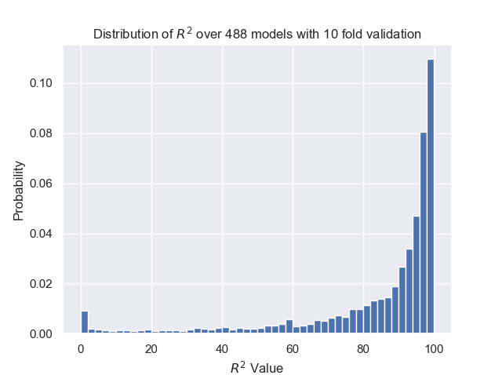
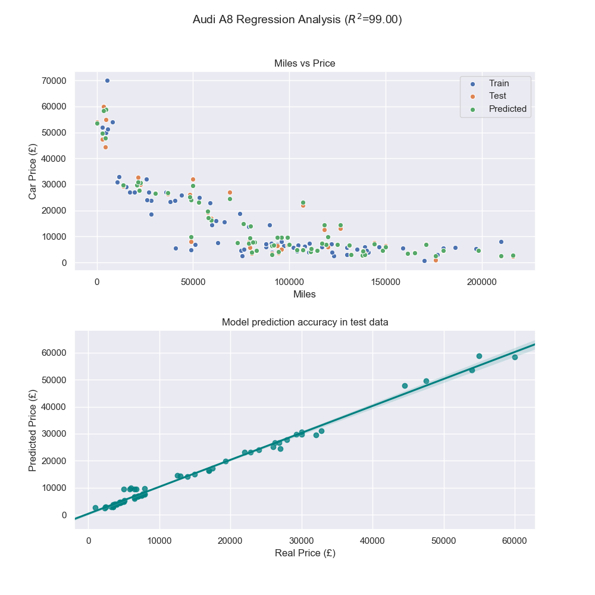
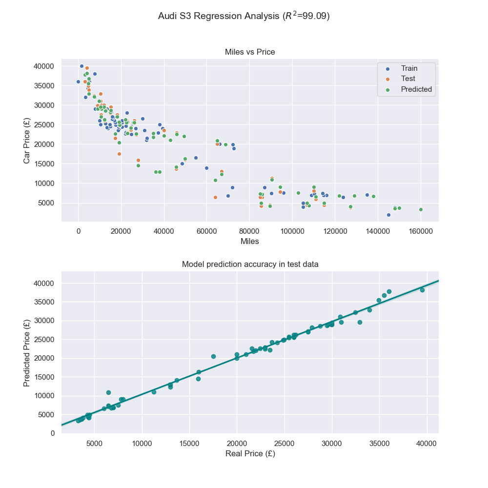
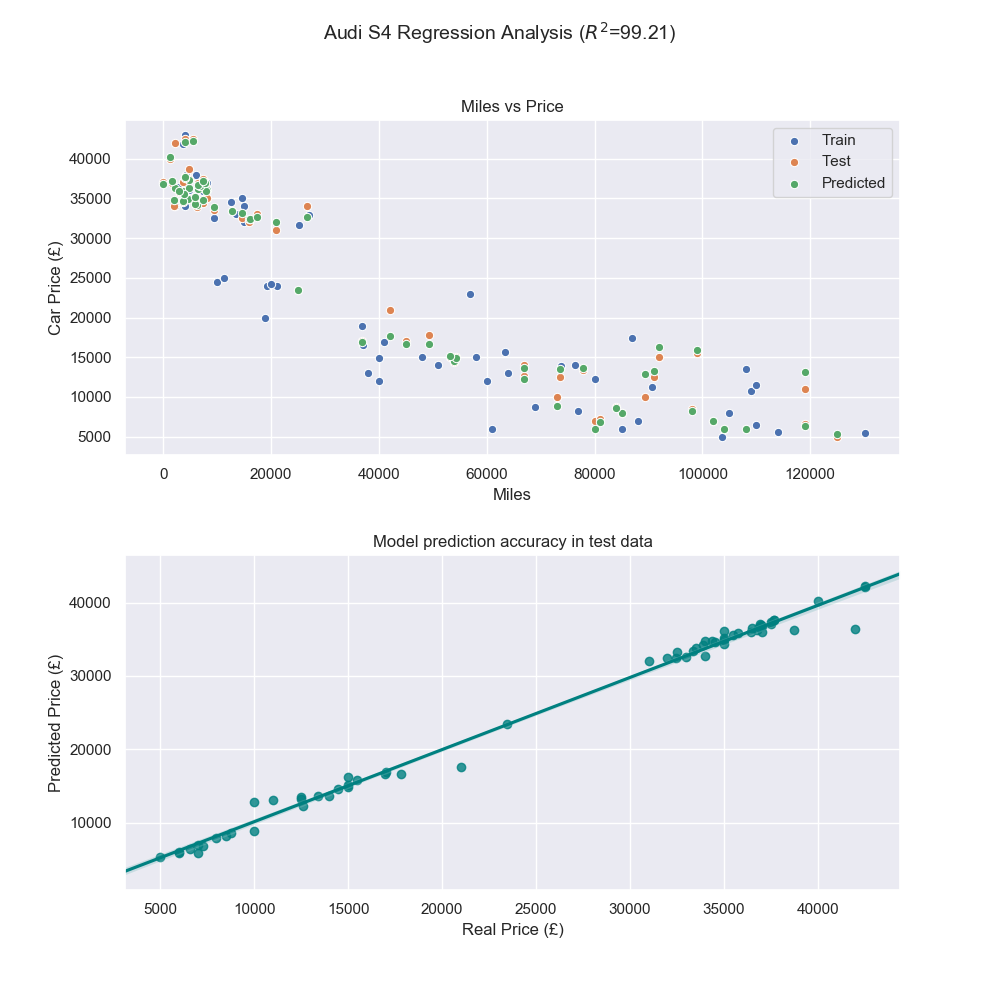
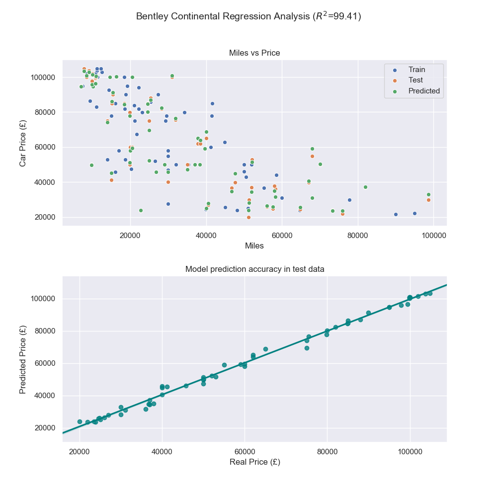
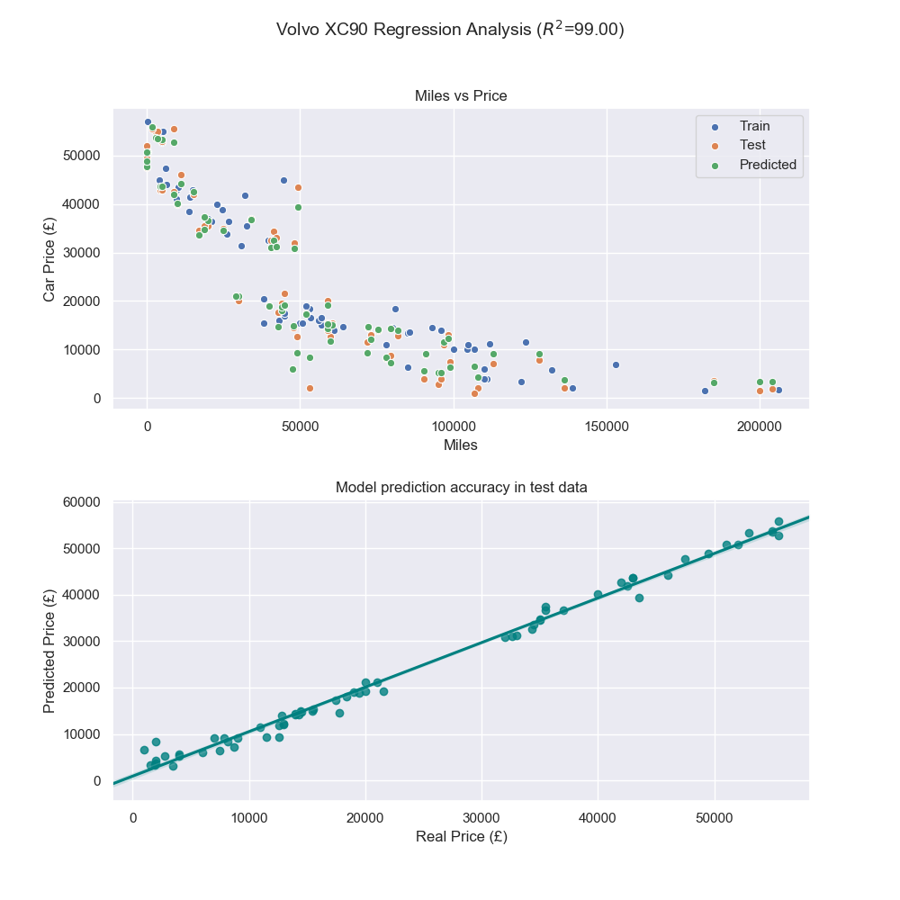

# Automated Used Car Price Predictions From https://www.autotrader.co.uk/
Machine Learning on large used cars database webscraped from AutoTrader - https://github.com/Ben-C-Harris/AutoTrader-Web-Scrapping-Used-Car-Database

I've created a database of used cars that have been web scraped from https://www.autotrader.co.uk/ which **includes 67,249 different cars**. The data set is shared within this Repo, however I will later be adding a new Repo showing how I created the data set through reliable web scraping. A selection of ten random rows of the dataset is as shown below:

```
      Make          Model           Name                                                                Price   Year   Miles    BHP   L   Trans     Fuel   
26935 Jeep          Grand Cherokee  Jeep Grand Cherokee 3.0 CRD V6 Overland 4x4 5dr                     5989.0  2007.0 79800.0  215.0 3.0 Automatic Diesel 
42907 Nissan        Qashqai         Nissan Qashqai 1.6 N-TEC 2WD 5dr                                    8500.0  2012.0 50000.0  113.0 1.6 Manual    Petrol 
11406 Chrysler      300C            Chrysler 300C 3.0 CRD V6 LUX 4dr                                    7495.0  2009.0 42889.0  218.0 3.0 Automatic Diesel 
2541  Audi          A4 Avant        Audi A4 AVANT TFSI SPORT 1.4 5dr                                    17200.0 2016.0 18379.0  148.0 1.4 Manual    Petrol 
63521 Volkswagen    Phaeton         Volkswagen Phaeton 3.0 TDI V6 4MOTION 4dr                           4895.0  2009.0 106000.0 237.0 3.0 Automatic Diesel 
2176  Audi          A3 Cabriolet    Audi A3 Cabriolet 1.8 TFSI Sport 2dr                                3965.0  2008.0 148082.0 158.0 1.8 Manual    Petrol 
10113 BMW           X5M             BMW X5 M 4.4 5dr                                                    54991.0 2016.0 14808.0  575.0 4.4 Automatic Petrol 
13550 Citroen       Ds3 Cabrio      Citroen DS3 CABRIO 1.6 DSPORT PLUS 3d 155 BHP * 3 MONTHS WARRANTY * 5995.0  2013.0 49000.0  153.0 1.6 Manual    Petrol 
35065 Mercedes-Benz A Class         Mercedes-Benz A Class A180 CDI Sport Edition 5dr - SAT NAV - …      12318.0 2015.0 45056.0  109.0 1.5 Manual    Diesel 
14909 Dacia         Sandero Stepway Dacia Sandero Stepway 0.9 Ambiance 5dr                              5995.0  2014.0 27000.0  90.0  0.9 Manual    Petrol 
```

# Model performance
Multiple Regression models have then been fit for each individual make and model of car including: Lasso, Random Forest, and Linear models with 10 KFolds validation. Model inputs have been: Year, Miles, BHP, and L with a predictor output of Price.

This is a non-linear problem, as such the linear regression model was shown to be the worst performing. The Random Forest regression model was found to be the best performing overall, delivering an **R<sup>2</sup> value of over 84 for over 60,000 different cars**, as shown below. Models with poor performance are generally in instances where model specification can wildly change the selling price of the vehicle. This attribute is not yet modelled.

```
— — — — — — — — — — — — — — — — — — — — — — — 
Total Average R2 value of: 84.37 over 488 Specific Models of car containing 61420 seperate vehicles in total with 10 KFolds each
— — — — — — — — — — — — — — — — — — — — — — — 
```

# R<sup>2</sup> distribution of models created
The distribution of R<sup>2</sup> for the models generated can be seen below:

<p align="center"></p>

# Model Fit Examples
Below shows some of the better performing models and how their model prediction compares to the test data:

<p align="center"></p>

<p align="center"></p>

<p align="center"></p>

<p align="center"></p>

<p align="center"></p>

# Dependencies
      os
      sys
      warnings
      pandas
      seaborn
      matplotlib.pyplot
      sklearn
     
# How to run
The model is simple to run and is commented to help share what is actually going on. Ensure you have the above packages installed in your environment and download/clone:

      
      carPricePredictRegression.py
      fullDataSet.pkl (Must be within dataSet dir as in GitHub folder layout)
      

The python file contains quite a few user set parameters, as explained below:

      LOAD_DATAFILE - The data file you wish to load from subdir dataSet
      PLOT - Would you like plots of regression predictions per model and overal histogram of R2 values
      PLOT_R2_THRESHOLD - R2 Value must be higher than this number to have regression model plot created. Note R2 histogram remains unchanged and will still include all R2 values
      MODELS - List of the three models you can choose from to see how results change
      MODEL_TYPE - Choose the model type as above using this number. i.e. 1 delivers Forest
      CROSS_FOLD_NUM - Number of KFold validation you wish to perform
      MINIMUM_NUMBER_OF_MODELS_COMPLETE - The minimum of car models to be evaluated before class terminates. This is good for debugging and simple testing.
      MINIMUM_NUMBER_OF_CARS_FOR_ANALYSIS - Minimum number of cars of type modelX required if regression is to be completed. This will stop you fitting to rare car models with only several examples for sale.
      DISABLE_SKLEARN_WARNING - SKLearn currently throws a warning over a future deprecated method, due to number of calls this fills the console at run time. Disable when you are happy that this is not an issue for you or your environment.
      PRINT_TO_CONSOLE - Would you like to write to .txt instead of console. Useful if your console doesnt remember all print statements.
      
Finally, run carPricePredictRegression.py and you're done. Any outputs requested will be generated within their appropriate directory.


